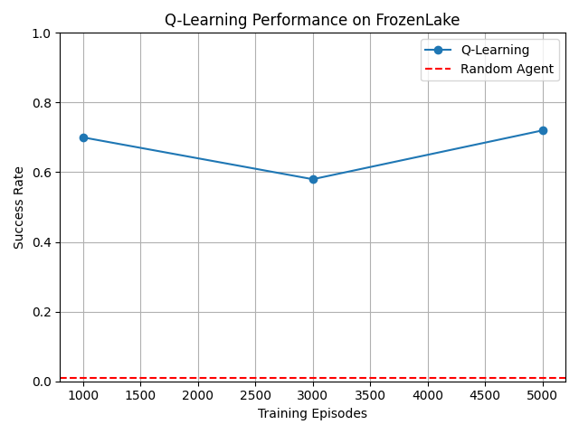
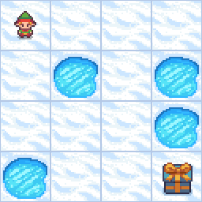

# Teach an Agent to Learn — FrozenLake

## 1. What is Reinforcement Learning?

Reinforcement Learning is a learning approach in which an agent interacts with an environment and uses rewards to improve its decisions. Instead of receiving the correct action for each situation, the agent learns from experience.

In this project, I used Q-learning to train an agent to reach the goal in FrozenLake while avoiding holes. I compared its performance with an agent that chooses actions randomly.

## 2. Gymnasium Environment

I used Gymnasium's default `FrozenLake-v1` environment. It has a 4×4 grid containing a starting position, frozen tiles, holes, and a goal.

The environment is slippery by default, so the agent may move in a different direction from the action it selected.

- **Environment:** The world the agent interacts with. Here, it is the FrozenLake grid and its movement rules.
- **Observation/state:** The agent's current position, represented by an integer from 0 to 15.
- **Action:** A movement choice: 0 = left, 1 = down, 2 = right, and 3 = up.
- **Reward:** The agent receives 1 for reaching the goal and 0 otherwise.
- **`env.reset()`:** Starts a new episode and returns the initial observation and an information dictionary.
- **`env.step(action)`:** Performs an action and returns `observation, reward, terminated, truncated, info`.
- **`terminated`:** Indicates that the episode ended because the agent reached the goal or fell into a hole.
- **`truncated`:** Indicates that the episode ended because of an external limit, such as the maximum number of steps.

An episode is one game, from the starting position until termination or truncation.

## 3. Random Agent

The random agent selects every action using:

```python
action = env.action_space.sample()
```

It does not learn or use previous experience. I evaluated it for 100 episodes to establish a baseline.

| Metric | Result |
|---|---:|
| Evaluation episodes | 100 |
| Successful episodes | 1 |
| Success rate | 0.01 (1%) |
| Average reward per episode | 0.01 |

The success rate and average reward are equal because each episode gives a total reward of either 1 for success or 0 for failure.

## 4. Q-Learning Agent

The Q-learning agent stores learned action values in a **Q-table** with 16 rows and 4 columns. Each row represents a state, and each column represents an action. All values start at zero.

### Parameters

| Parameter | Value | Purpose |
|---|---:|---|
| Learning rate (`alpha`) | 0.8 | Controls how strongly new information changes a Q-value |
| Discount factor (`gamma`) | 0.95 | Controls the importance of future rewards |
| Initial exploration rate (`epsilon`) | 1.0 | Initial probability of choosing a random action |
| Epsilon decay | 0.995 | Reduces exploration after each training episode |
| Minimum epsilon | 0.01 | Keeps a small amount of exploration during training |

### Action selection

During training, the agent uses an epsilon-greedy strategy:

- With probability `epsilon`, it selects a random action to explore.
- Otherwise, it selects the action with the highest Q-value for its current state.

Epsilon decreases after each episode, so the agent gradually relies more on what it has learned.

### Q-value update

The update used in the code is:

```python
q_table[state, action] += alpha * (
    reward
    + gamma * np.max(q_table[next_state])
    - q_table[state, action]
)
```

This adjusts the current action value using the reward received and the best estimated value available in the next state. Repeated updates allow information about reaching the goal to spread to earlier states.

During evaluation, the agent always chooses the action with the highest Q-value. It does not explore or update the table.

The final script trains for 5,000 episodes and evaluates the learned policy for 100 episodes. It saves the Q-table to `results/q_table.npy`.

## 5. Experiments

I changed one variable: **the number of training episodes**. I kept the learning rate, discount factor, initial epsilon, epsilon decay, and minimum epsilon unchanged.

Each trained agent was evaluated for 100 episodes.

| Experiment | Training episodes | Alpha | Gamma | Initial epsilon | Success rate |
|---|---:|---:|---:|---:|---:|
| Random Agent | — | — | — | — | 0.01 |
| Experiment 1 | 1,000 | 0.8 | 0.95 | 1.0 | 0.70 |
| Experiment 2 | 3,000 | 0.8 | 0.95 | 1.0 | 0.58 |
| Experiment 3 | 5,000 | 0.8 | 0.95 | 1.0 | 0.72 |

### What changed, and why?

All three Q-learning experiments performed better than the random baseline. The 5,000-episode experiment had the highest observed success rate, at 72%.

However, performance did not improve steadily: the 3,000-episode experiment scored lower than the 1,000-episode experiment. Training includes random exploration, and FrozenLake has slippery movement, so results can vary between runs. These individual runs do not prove that one training duration is consistently better; repeated runs would provide a more reliable comparison.

## 6. Results

The random agent succeeded in 1% of its evaluation episodes, while the Q-learning experiments achieved success rates between 58% and 72%.



The graph compares the three training experiments. The red dashed line shows the random baseline. These points represent separate training runs, rather than measurements taken during one continuous training run.

### Learned agent demonstration

For Part 5, I ran the 5,000-episode training script again and saved the resulting Q-table. This additional run achieved **73 successful episodes out of 100**. It is separate from the three experiments recorded above.

The `show_agent.py` script loads the saved table and selects the highest-valued action in each state. It captures game frames and saves the first successful episode as a GIF, allowing up to 20 attempts.

The recorded demonstration succeeded on its first attempt.



The GIF demonstrates a successful episode. The 100-episode evaluation provides the performance measurement.

### Running the project

Install the required packages in your Python environment:

```bash
python -m pip install "gymnasium[toy-text]" numpy pandas matplotlib pillow
```

From the project folder, run:

```bash
python src/random_agent.py
python src/q_learning.py
python src/plot_results.py
python src/show_agent.py
```

Run `q_learning.py` before `show_agent.py` to create the saved Q-table. Running training again replaces the saved table and may produce a different success rate. The experiment CSV contains the recorded experiment results and is not automatically updated by training.

### Project structure

```text
README.md
src/
    explore_env.py
    random_agent.py
    q_learning.py
    plot_results.py
    show_agent.py
results/
    results.csv
    learning_curve.png
    q_table.npy
    learned_agent.gif
```

## 7. What I Learned

This project helped me understand the difference between choosing random actions and using values learned from experience. The random agent does not improve, while Q-learning updates action values based on rewards and possible future outcomes.

I learned why exploration is needed: the agent must try actions before it can discover useful behavior. I also learned that more training does not guarantee a better result in every individual run.

Finally, I learned to separate a visual demonstration from a performance evaluation. A successful GIF shows that the agent can complete the environment, but repeated evaluation episodes give stronger evidence about its reliability.

## 8. AI Usage

I used ChatGPT for step-by-step explanations, code suggestions, and help preparing this README.

### One important prompt

> “tamam part 5 e bastan baslayalim”

This means: “Okay, let's start Part 5 from the beginning.”

### One useful answer

The AI explained how to save the learned Q-table with `np.save`, load it in a separate script, and collect rendered frames to create a GIF. This helped connect the training code to a visible demonstration.

### One weak suggestion

The AI initially suggested code that saved results using relative paths such as `results/q_table.npy` without making the working-directory requirement clear enough. These paths depend on running the script from the project folder. The running instructions now explicitly state this requirement.

### One modification I made

I changed the number of training episodes to 1,000, 3,000, and 5,000 for the experiments while keeping the other parameters unchanged. I ran the scripts locally and recorded the resulting success rates.

The AI also supplied code for the visualization and drafted this documentation. Its assistance is disclosed here.

## Final Question

### How can you tell that your agent actually learned rather than simply getting lucky?

I evaluated each trained agent over 100 episodes instead of judging it from one successful game. The Q-learning experiments achieved success rates of 58–72%, compared with 1% for the random agent. During evaluation, the agent used its learned Q-table without exploration or further updates, which supports the conclusion that its learned action choices were useful. However, repeated training and evaluation with multiple random seeds would provide stronger evidence and help measure how consistent the improvement is.